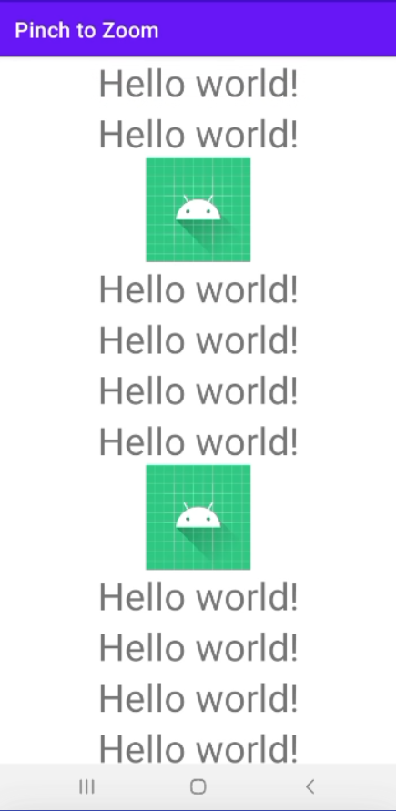
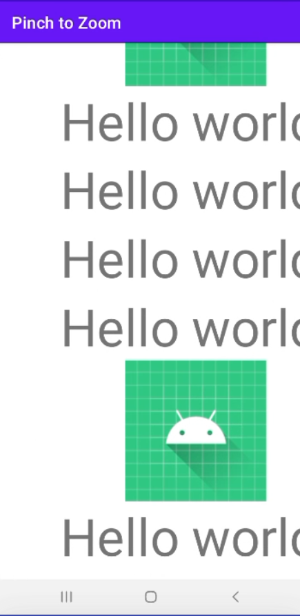

# Pinch to Zoom Linear Layout With ScrollView
In this project, i'm going to implement zoom on ScrollView. Most of the time when we create a scroll view then
it contains a lot of data and if we want to view any content on zooming then we can implement this feature.
This feature can be useful when we are scroll in an App and that contains data using RecyclerView or viewGroups.
Note that we are going to implement this project using the Java language. 

Sample Images are attached below


## Normal View

 


## Zoomed View with Scroll View

 

## Deployment

#### Step1
Create Custom class ZoomLinearLayout or you can give any custom name

```bash
  public class ZoomLinearLayout extends LinearLayout implements ScaleGestureDetector.OnScaleGestureListener {

    private enum Mode {
        NONE,
        DRAG,
        ZOOM
    }

    private static final float MIN_ZOOM = 1.0f;
    private static final float MAX_ZOOM = 4.0f;

    private Mode mode = Mode.NONE;
    private float scale = 1.0f;
    private float lastScaleFactor = 0f;

    private float startX = 0f;
    private float startY = 0f;

    private float dx = 0f;
    private float dy = 0f;
    private float prevDx = 0f;
    private float prevDy = 0f;

    public ZoomLinearLayout(Context context) {
        super(context);
        init(context);
    }

    public ZoomLinearLayout(Context context, AttributeSet attrs) {
        super(context, attrs);
        init(context);
    }

    public ZoomLinearLayout(Context context, AttributeSet attrs, int defStyle) {
        super(context, attrs, defStyle);
        init(context);
    }

    public void init(Context context) {
        final ScaleGestureDetector scaleDetector = new ScaleGestureDetector(context, this);
        this.setOnTouchListener(new OnTouchListener() {
            @Override
            public boolean onTouch(View view, MotionEvent motionEvent) {
                switch (motionEvent.getAction() & MotionEvent.ACTION_MASK) {
                    case MotionEvent.ACTION_DOWN:
                        if (scale > MIN_ZOOM) {
                            mode = Mode.DRAG;
                            startX = motionEvent.getX() - prevDx;
                            startY = motionEvent.getY() - prevDy;
                        }
                        break;
                    case MotionEvent.ACTION_MOVE:
                        if (mode == Mode.DRAG) {
                            dx = motionEvent.getX() - startX;
                            dy = motionEvent.getY() - startY;
                        }
                        break;
                    case MotionEvent.ACTION_POINTER_DOWN:
                        mode = Mode.ZOOM;
                        break;
                    case MotionEvent.ACTION_POINTER_UP:
                        mode = Mode.DRAG;
                        break;
                    case MotionEvent.ACTION_UP:
                        mode = Mode.NONE;
                        prevDx = dx;
                        prevDy = dy;
                        break;
                }
                scaleDetector.onTouchEvent(motionEvent);

                if ((mode == Mode.DRAG && scale >= MIN_ZOOM) || mode == Mode.ZOOM) {
                    getParent().requestDisallowInterceptTouchEvent(true);
                    float maxDx = (child().getWidth() - (child().getWidth() / scale)) / 2 * scale;
                    float maxDy = (child().getHeight() - (child().getHeight() / scale)) / 2 * scale;
                    dx = Math.min(Math.max(dx, -maxDx), maxDx);
                    dy = Math.min(Math.max(dy, -maxDy), maxDy);
                    applyScaleAndTranslation();
                }

                return true;
            }
        });
    }

    @Override
    public boolean onScaleBegin(ScaleGestureDetector scaleDetector) {
        return true;
    }

    @Override
    public boolean onScale(ScaleGestureDetector scaleDetector) {
        float scaleFactor = scaleDetector.getScaleFactor();
        if (lastScaleFactor == 0 || (Math.signum(scaleFactor) == Math.signum(lastScaleFactor))) {
            scale *= scaleFactor;
            scale = Math.max(MIN_ZOOM, Math.min(scale, MAX_ZOOM));
            lastScaleFactor = scaleFactor;
        } else {
            lastScaleFactor = 0;
        }
        return true;
    }

    @Override
    public void onScaleEnd(ScaleGestureDetector scaleDetector) {
    }

    private void applyScaleAndTranslation() {
        child().setScaleX(scale);
        child().setScaleY(scale);
        child().setTranslationX(dx);
        child().setTranslationY(dy);
    }

    private View child() {
        return getChildAt(0);
    }

}
```

#### Step2
Then in Layout file, Wrap your LinearLayout which you want to zoom with ZoomLinearLayout. Note that you have only one direct child for ZoomLinearLayout.

```bash

<?xml version="1.0" encoding="utf-8"?>
<ScrollView xmlns:android="http://schemas.android.com/apk/res/android"
    xmlns:tools="http://schemas.android.com/tools"
    android:layout_width="match_parent"
    android:layout_height="match_parent"
    android:fillViewport="true"
    tools:context=".MainActivity">

    <com.example.pinchtozoom.ZoomLinearLayout
        android:id="@+id/zoom_linear_layout"
        android:layout_width="match_parent"
        android:layout_height="match_parent">

        <LinearLayout
            android:layout_width="match_parent"
            android:layout_height="match_parent"
            android:gravity="center"
            android:orientation="vertical">

            <TextView
                android:layout_width="wrap_content"
                android:layout_height="wrap_content"
                android:text="Hello world!"
                android:textSize="36sp" />

            <TextView
                android:layout_width="wrap_content"
                android:layout_height="wrap_content"
                android:text="Hello world!"
                android:textSize="36sp" />

            <ImageView
                android:layout_width="wrap_content"
                android:layout_height="wrap_content"
                android:background="@drawable/ic_launcher_background"
                android:src="@drawable/ic_launcher_foreground" />

            <TextView
                android:layout_width="wrap_content"
                android:layout_height="wrap_content"
                android:text="Hello world!"
                android:textSize="36sp" />

            <TextView
                android:layout_width="wrap_content"
                android:layout_height="wrap_content"
                android:text="Hello world!"
                android:textSize="36sp" />

            <ImageView
                android:layout_width="wrap_content"
                android:layout_height="wrap_content"
                android:background="@drawable/ic_launcher_background"
                android:src="@drawable/ic_launcher_foreground" />

            <TextView
                android:layout_width="wrap_content"
                android:layout_height="wrap_content"
                android:text="Hello world!"
                android:textSize="36sp" />

            <TextView
                android:layout_width="wrap_content"
                android:layout_height="wrap_content"
                android:text="Hello world!"
                android:textSize="36sp" />

            <TextView
                android:layout_width="wrap_content"
                android:layout_height="wrap_content"
                android:text="Hello world!"
                android:textSize="36sp" />

            <TextView
                android:layout_width="wrap_content"
                android:layout_height="wrap_content"
                android:text="Hello world!"
                android:textSize="36sp" />

            <TextView
                android:layout_width="wrap_content"
                android:layout_height="wrap_content"
                android:text="Hello world!"
                android:textSize="36sp" />

        </LinearLayout>

    </com.example.pinchtozoom.ZoomLinearLayout>

</ScrollView>

```

### Step3
Now in MainActivity, create ZoomLinearLayout object and set the onTouch() event for it.

```bash
final ZoomLinearLayout zoomLinearLayout = (ZoomLinearLayout) findViewById(R.id.zoom_linear_layout);
zoomLinearLayout.setOnTouchListener(new View.OnTouchListener() {
    @Override
    public boolean onTouch(View v, MotionEvent event) {
        zoomLinearLayout.init(MainActivity.this);
        return false;
    }
});
```

## Authors

- [tauseefrehman2 - linkedin](https://www.linkedin.com/in/tauseefrehman2/)
- [tauseefr2 - Fiverr](https://www.fiverr.com/users/tauseefr2/seller_dashboard)


## 🛠 Skills
- Java, Android, Xml, Api's, Firebase
- Flutter, Firebase, API's, Google maps


## Documentation

[Refference link](https://stackoverflow.com/questions/38367291/pinch-zoom-for-linearlayout-in-android)

